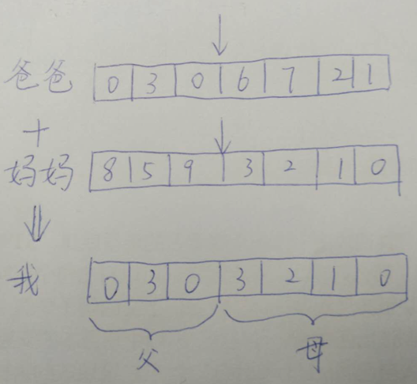

### 数学建模

#### 遗传算法 Genetic Algorithm
>
    迭代产生一种搜索最优解的方法
    
- 采用概率化的寻优方法，不需要确定的规则就能自动获取和指导优化的搜索空间，自适应地调整搜索方向。

- 在每一代，根据问题域中个体的适应度（fitness）大小选择（selection）个体，并借助于自然遗传学的遗传算子（genetic operators）进行组合交叉（crossover）和变异（mutation），产生出代表新的解集的种群。

#### 图解

#### 典型
>
    寻找一元函数的最优解

###### 袋鼠蹦跳

- 爬山算法
- 模拟退火
- 遗传算法
>
    随机降落  低海拔处射杀 自适应聚拢到高处

**遗传算法并不保证你能获得问题的最优解，但是使用遗传算法的最大优点在于你不必去了解和操心如何去“找”最优解。（你不必去指导袋鼠向那边跳，跳多远。）而只要简单的“否定”一些表现不好的个体就行了。（把那些总是爱走下坡路的袋鼠射杀，这就是遗传算法的精粹！）**

#### 步骤
- 随机产生种群
- 根据策略判断适应度 最优选择
- 依据适应度选择父母 
-  父母染色体 按照一定的方法进行交叉（染色体即为解决方案）
- 变异

#### 核心
- 参数的编码
- 初始种群的设置
- 适应度函数
- 遗传操作
-  控制参数

#### 术语
- 基因型（genotype） 性状染色体的内部表现
- 表现型：染色体决定的性状的外部表现
自变量
- 编码
表现型-> 基因型
- 解码
基因型 -> 表现型
- 个体
- 种群
- 样本
- 适应度函数
- 交叉
- 变异
- 复制

### 术语的详细介绍
###### 1.基因和染色体
在遗传算法中，我们首先需要将要解决的问题映射成一个数学问题，也就是所谓的“数学建模”，那么这个问题的一个可行解即被称为一条“染色体”。一个可行解一般由多个元素构成，那么这每一个元素就被称为染色体上的一个“基因”。

######  2.适应度函数
优胜略汰的淘汰函数 打分 并进行评判 然后将适应度低的染色体淘汰

###### 3.交叉
交叉的过程需要从上一代的染色体中寻找两条染色体，一条是爸爸，一条是妈妈。然后将这两条染色体的某一个位置切断，并拼接在一起，从而生成一条新的染色体。这条新染色体上即包含了一定数量的爸爸的基因，也包含了一定数量的妈妈的基因。

每一次进化之后 计算每一条染色体的适应度 然后使用公式计算适应度概率 保留高概率

>
    染色体被选择的概率=染色体的适应度/所有染色体的适应度之和

###### 4.变异
随机选取 随机修改基因 引入新的基因

###### 5.复制
寻找适应度最高的染色体 保留适应度高的染色体

#### 流程
- 初始化 生成随机的解 第一代染色体
- 计算染色体的适应度 并根据适应度计算每一条染色体进化中被选中的概率
- 交叉 生成N-M 条
- 变异 生成N-M 条
- 复制 M条

###其他
###### 进化次数的选取
- 事先统计进化次数
###### 限定允许的范围
如果算法要达到全局最优解可能要进过很多很多很多次的进化，这极大影响系统的性能。那么我们就可以在算法的精确度和系统效率之间寻找一个平衡点。我们可以事先设定一个可以接收的结果范围，当算法进行X次进化后，一旦发现了当前的结果已经在误差范围之内了，那么就终止算法。

### 算法使用的实际意义
>
    负载均衡的调度问题

假设N个任务task 负载均衡的分配给M个服务器节点node **任务长度已知服务器节点处理速度已知** 请给出一种任务分配方式，使得所有任务的总处理时间最短。

### 建模

#### 任务长度矩阵（tasks）
>
    Tasks={2,4,6,8}
tasks[i] 中i为任务编号 task[i]为任务长度

#### 节点处理速度矩阵
>
    Nodes={2,1}
nodes[j] 中j为节点编号 node[j]为处理速度

#### 任务处理时间矩阵
>
    timeMatrix 二维数组
timeMatrix[i][j]表示将任务i分配给节点j处理所需要的时间 
>
    timeMatrix[i][j]=tasks[i]/nodes[j]

#### 染色体
每次进化都会产生N条染色体，每一条染色体都是当前问题的一个可行解，可行解由多个元素构成，每个元素称为染色体的一个基因。

> 
    chromosome={1,2,3,4}
一条染色体 **下标表示任务编号 值表示节点编号**

####适应度矩阵
适应度函数，它会评判每一条染色体的适应度，并保留适应度高的染色体、淘汰适应度差的染色体。那么在算法实现时，我们需要一个适应度矩阵，记录当前N条染色体的适应度

>
    adaptability={0.6,2,3.2,1.8}
**数组下标为染色体的编号 值为染色体的适应度**

在负载均衡调度这个实例中，我们将N个任务执行总时长作为适应度评判的标准。当所有任务分配完后，如果总时长较长，那么适应度就越差；而总时长越短，则适应度越高。

#### 选择概率矩阵
>
    selectionProbability={0.1,0.4,0.2,0.3}
记录每条染色体在进化过程中被选中的概率

>
    selectionProbability=adaptability[i]/适应度之和

#### 轮盘赌算法
>
    个体被选中的概率与其适应度函数成正比

>
    P=fi/(fi+f2+...+fn)

##### 工作流程
设想群体全部个体的适应性分数由饼图代表

快大小和适应性分数成正比 **轮盘赌既是旋转轮盘直到其停止**
###参考
- [https://blog.csdn.net/u012422446/article/details/68061932]
- [https://www.jianshu.com/p/ae5157c26af9]
- [https://www.cnblogs.com/gaosheng12138/p/7534956.html]

